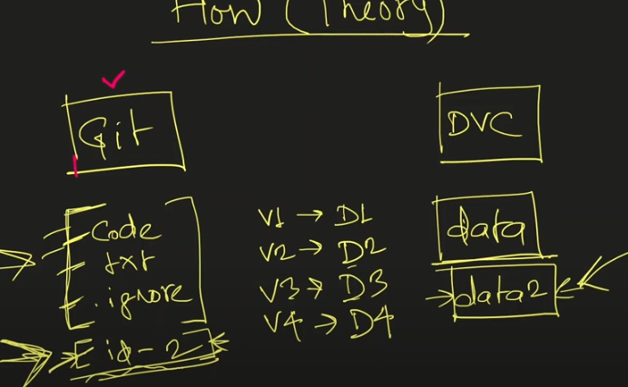
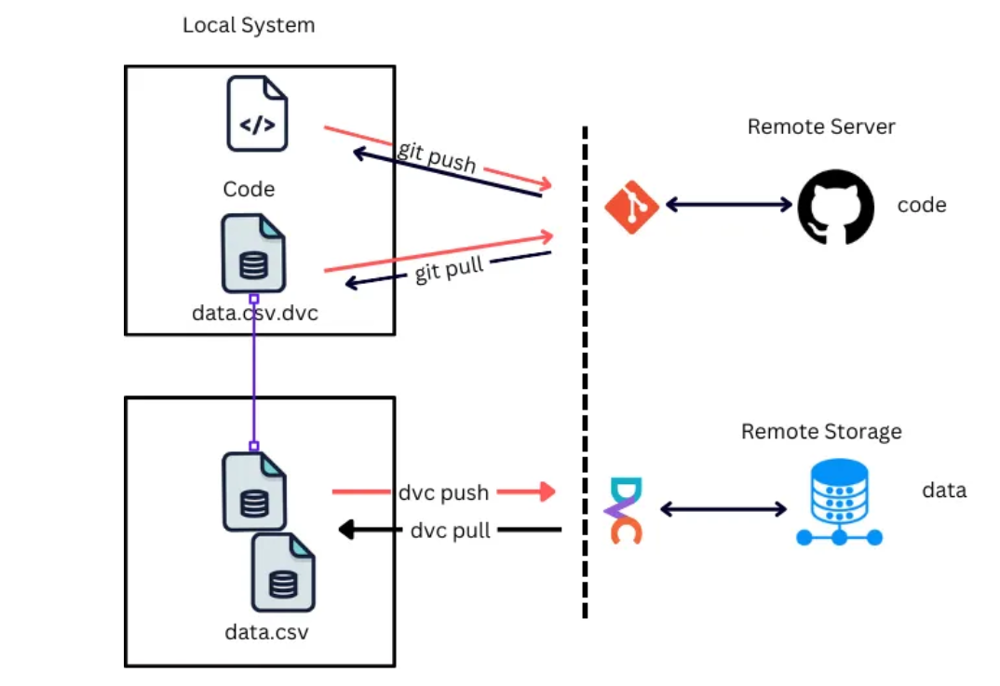

# **Data Version Control**

## **What is DVC**
DVC is an open-source version control system for ML projects.

    Works on top of Git, adds features for
    
        Dataset and model versioning.
        Pipeline management (track preprocessing → training → evaluation).
        Storage backends (local, S3, Google Drive, Azure, SSH, etc.).

## **Why we use DVC**
In Machine Learning projects, datasets and models are often large and constantly changing.

**Git works well for code, but not efficient for large files like datasets, models, or experiment outputs.**

    DVC helps by

        Tracking datasets and models just like Git tracks code.
        Avoiding storing huge files inside Git.
        Making ML experiments reproducible.
        Sharing large files across team members without bloating the Git repo

## **How it works**

    Imagine you go to a market.
    The market doesn’t allow you to take phones, wallet, or shoes inside.
    So, you have to store them at the counter.
    But there’s a problem:
        Shoes can’t be stored together with phones and wallets (different type of storage).
        So, there are two separate counters:
        Counter 1 (DVC storage):
            You store your shoes here (representing large files like datasets/models).
            When you store them, the counter gives you a unique claim token/ID.
        Counter 2 (Git):
            You store your wallet, phone, and the unique claim token here (representing code, configs, and .dvc metafiles).
            The token ensures you can always get your exact pair of shoes back later, even if many people stored shoes.

**Key Mapping**

    Shoes = Large Data/Models
    Counter 1 (DVC) = Data Storage (local/S3/GDrive/etc.)
    Unique ID = .dvc file (metadata about the data)
    Counter 2 (Git) = Git Repository (stores code + metadata, not the heavy files)

So when you want your shoes back:

You check Git for the unique ID.

You go to DVC storage with that ID.

You get your exact shoes back (correct dataset/model version).

## **How To Connect with Git and its Workflow**
    1. Create git repo and clone it in local.
    2. Create any file and data file 
    3. Do a git add-commit-push before initializing dvc.
    # pip install dvc
    4. Now we do "dvc init" (creates .dvcignore, .dvc)
    5. Now do "mkdir S3" (creates a new S3 directory) This is local directory but you can also use remote by given link of remote directoy like aws 
    6. Now we do "dvc remote add -d myremote S3"
    7. Next "dvc add data/"  data is dir where our data file is store
       Now it will ask to do: ("git rm -r --cached 'data'" and "git commit -m "stop tracking data"")
       Because initially we were tracking data/ folder from git so now we remove it for DVC to handle.
    8. Again we do "dvc add data/" (creates data.dvc) then "git add .gitignore data.dvc"
    9. Now - "dvc commit" and then "dvc push"
    9. Do a git add-commit-push to mark this stage as first version of data.
    10. Now make changes to mycode.py to append a new row in data, check changes via "dvc status"
    11. Again - - "dvc commit" and then "dvc push"
    12. Then git add-commit-push (we're saving V2 of our data at this point)
    13. Check dvc/git status, everything should be upto date.
    14. Now repeat step 10-12 for v3 of data.