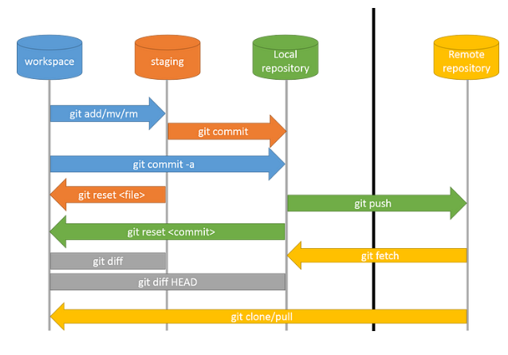
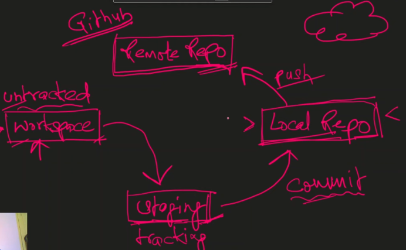

# **Git and GitHub**

## Git

Git is a version control system  that remembers every change you make in your project.

- Track what you changed, when, and why
- Go back to any earlier version if something breaks
- Work together with other people without messing up each others code

## GitHub

GitHub is a cloud-based hosting platform for Git repositories.

It makes it easy to:

- Store your Git projects online
- Share your code with others
- Collaborate with teammates from anywhere
- Manage issues, pull requests, and project workflows
- Showcase your projects publicly or keep them private

## **In short**

Git : the tool that manages your code history locally

GitHub : the place where you store and share that code online

## **Diagram**

### Workspace

What it is: The folder on your computer where you’re actively working on files.

Analogy: Your desk  you can scribble, erase, and experiment.

Git status: Files here are untracked or modified, but not yet staged.

### Staging Area

What it is: A temporary area where you collect changes that you want to include in the next commit.

Analogy: A tray on your desk you place documents here when they’re ready to be filed.

Git status: Files here are staged and waiting for a commit.

Command to stage: git add file_name or git add . for all files

### Local Repository

What it is: The hidden .git folder on your computer that stores your project’s history (commits, branches, tags, etc.).

Analogy: Your personal filing cabinet it holds every past version of your work, but it’s only on your machine.

Git status: Files here are committed.

Command to commit: git commit -m 'message'

### Remote Repository

What it is: A copy of your repository stored on a server (e.g., GitHub, GitLab, Bitbucket).

Analogy: Cloud storage for your filing cabinet  others can access it, and you can sync changes between local and remote.

Git status: Files are pushed or pulled here.

Command to push: git push 

### **Git and GitHub Setup**
- **Git Config**

Set your identity
    - git config --global user.name "User Name"
    - git config --global user.email "your.email@example.com"

set default branch name to main
    - git config --global init.defaultBranch main

- **Connect Local Repo to GitHub**
    - Create a local folder or navigate to your project
        - mkdir dir_name
        - cd dir_name 
        - git init 
    - Add GitHub repository as remote
        - git remote add origin https://github.com/YourUsername/dir_name.git
    - Check Status
        - git status

- **Seeing commits**

    To see commits in Git use the git log

        git log
            This shows: Commit hash (unique ID),Author,Date,Commit message
        git log --online 
            Shows short commit hash + commit message , Great for quickly seeing history
        git log --oneline --graph --all --decorate
            shows graphic view , Displays commits as a tree , Shows branches and merges visually
        git log -n 3
            Shows lattest n commits
        git show <commit-hash>
            shows specic commit-hasd id changing
        git log --stat
            Shows details of changes on commit level
        git log -p 
            - shows code changes on commit level
        git diff 
            shows changes made within staging area before commit
    
- **Branching And Merging**

        git branch branch_name commit id
            create a new branch from the given commit id
        git branch
            lists all branches
        git checkout branch_name
            switch to another branch
        git log --online --all
            see commits of all branches
        git log online --all -- graph
            see commits of all branches in graph form
        git branch -d branch_name 
            deleta a branch of a given name
        git merge branch
            run from master branch it will merge the given branch with master branch
    

